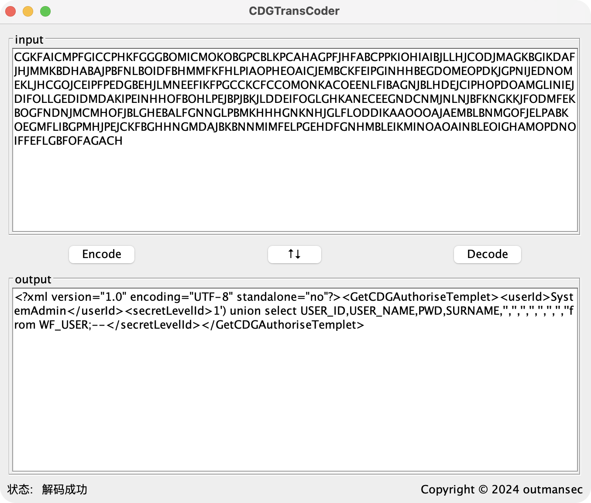

  <h1 align="center">CDGTransCoder</h1>
  

    
    
    
  

  
一款java编写全平台使用的亿赛通CDG编码解码工具

  

    
  

## 功能特点
- 亿赛通电子文档安全管理系统（CDG）数据包编码解码工具。
## 特别感谢
- [Esafenet-analize](https://github.com/LuckyTain/Esafenet-analize)
- [CDGXStreamDeserRCE](https://github.com/0xf4n9x/CDGXStreamDeserRCE)
